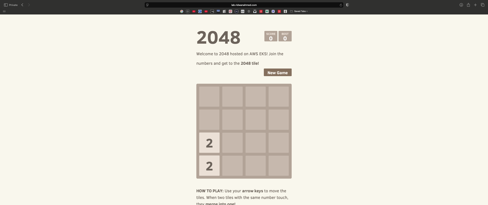
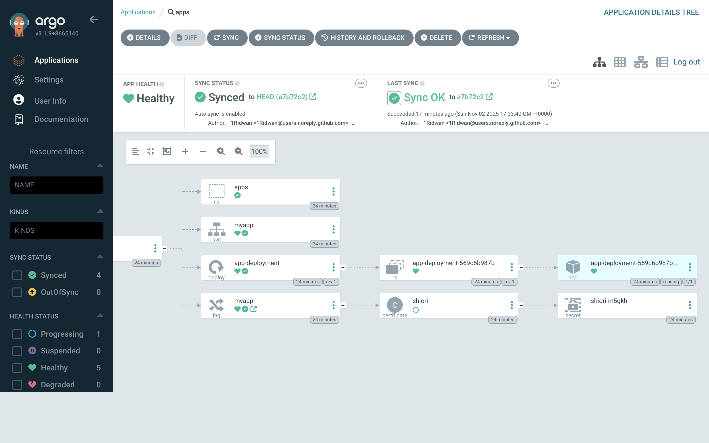
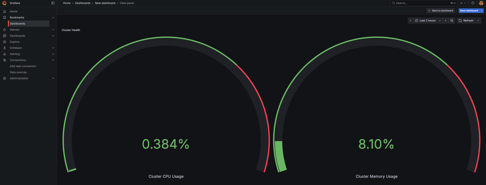

# 2048 on AWS EKS

## Overview

This project deploys the open-source [2048](https://github.com/gabrielecirulli/2048) game on **Amazon EKS**, using a **highly available, production-grade architecture** spanning three availability zones.  

It demonstrates end-to-end DevOps practices — Infrastructure as Code **(IaC)**, containerisation, CI/CD automation, and GitOps deployment with **ArgoCD**.

2048 is a web-based number puzzle where you combine tiles to reach the number 2048.  
This deployment turns it into a real-world cloud-native workload to showcase scalable Kubernetes deployment on AWS.

---

## Key Features
- Highly available **EKS cluster** distributed across multiple AZs.  
- **Terraform**-managed VPC, networking, and EKS resources.  
- **ArgoCD GitOps pipeline** for automated deployment.  
- **Helmfile** to manage and install Helm charts consistently.  
- Full **CI/CD automation** from code commit → container build → cluster deployment.  
- Integrated **monitoring (Prometheus, Grafana)** and **security hardening (EKS Pod Identity, IAM least privilege)**.

---

## Architecture Diagram


### Architecture Description
> - **Amazon EKS**: Managed Kubernetes control plane and worker nodes.  
> - **Public subnets**: Host ingress and network load balancer.  
> - **Private subnets**: Run application workloads and cluster services securely.  
> - **NAT Gateway**: Provides outbound internet for worker nodes to pull container images.  
> - **Nginx Ingress Controller**: Routes traffic to services through Ingress resources.  
> - **External DNS**: Dynamically updates Route53 records for subdomain `lab.ridwanahmed.com`.  
> - **Cert-Manager**: Issues and renews TLS certificates automatically via Let’s Encrypt.  
> - **Prometheus & Grafana**: Provide observability and cluster health visualisation.  

---

## Architecture Components

| AWS Resource / Tool                  | Purpose                                                                 |
|--------------------------------------|-------------------------------------------------------------------------|
| **EKS**                              | Runs Kubernetes workloads across multiple AZs                           |
| **ECR**                              | Stores Docker images built by the CI/CD pipeline                        |
| **NGINX Ingress Controller**         | Manages inbound HTTP/HTTPS traffic                                      |
| **External DNS**                     | Automates DNS record creation for ingress endpoints                     |
| **Cert-Manager & Let’s Encrypt**     | Issues SSL/TLS certificates automatically                               |
| **Prometheus**                       | Collects metrics for monitoring cluster performance                     |
| **Grafana**                          | Visualises metrics and logs for operational insights                    |
| **EKS Pod Identity**                 | Provides fine-grained AWS permissions to pods securely                  |
| **AWS S3 (Terraform Backend)**       | Stores Terraform state with remote locking                              |

---

## CI/CD and GitOps Workflow

This project integrates **GitHub Actions**, **Helmfile**, and **ArgoCD** into a fully automated GitOps pipeline.

### Pipeline 1: Terraform
- **GitHub Actions** triggers on every push on changes to ./terraform
- The workflow:
  1. Runs terraform linting.
  2. Runs **Checkov** to scan Terraform and Kubernetes manifests for security issues.  
  3. Creates a terraform plan and saves this as a manifest file to be used in the next step.
  4. Runs terraform apply using the exact same plan from step 3 by using the artifact
  
### Pipeline 2: Automated Deployment with ArgoCD
- **Helmfile** declaratively manages all Helm charts for cluster add-ons (e.g., Nginx Ingress Controller, Cert-Manager, Prometheus, Grafana) 
- **ArgoCD** monitors the Git repository for changes to any manifest file 
  1. Builds the **Docker image** of the 2048 app.  
  2. Pushes the image to **Amazon ECR**.  
  3. Updates and commits the image tag inside the Kubernetes manifest file using the SHA of the build workflow for clear visibility of which workflow created the image.
- When the commit is detected:
  4. ArgoCD automatically **synchronises** the desired state with the live cluster.  
  5. New application pods are deployed using rolling updates (old pods remain active until the new ones are healthy).  

This enables **zero-downtime deployments**, **version-controlled infrastructure**, and **rapid feature rollout** by simply committing code changes.

---
## Security

- **EKS Pod Identity (Replacing IRSA):**
  - This project uses **EKS Pod Identity** instead of the traditional IAM Roles for Service Accounts (IRSA).
  - Pod Identity provides a more secure and simplified approach to granting AWS permissions directly to pods without requiring OIDC providers or service account annotations.
  - Each pod that needs access to AWS services (e.g., S3, Route53) is assigned a dedicated **Pod Identity association** linked to an IAM role.
  - This ensures tighter permission boundaries, automatic credential rotation, and easier debugging compared to IRSA.
  - It also eliminates the need for managing IAM OIDC providers, reducing operational complexity and improving cluster security posture.
- **IAM Roles** follow the principle of least privilege
- **Checkov** scans all Terraform and manifest code for security misconfigurations.

---

## Screenshots






---

## Local Development

```bash
# Clone the repository
git clone https://github.com/1Ridwan/ECS.git
cd app

# Build and run locally
docker build -t 2048-app:local .
docker run -d --rm --name 2048-app -p 8080:8080 2048-app:local
```
Then open:
http://localhost:8080

## Why This Project?

This project validates my ability to design, deploy, and automate production-grade cloud-native systems using AWS and Kubernetes.

It demonstrates practical expertise in:
- Containerisation and image optimisation
- Infrastructure provisioning with Terraform
- CI/CD automation and GitOps workflows
- Kubernetes operations with ArgoCD and Helmfile
- Observability and cloud security best practices


## Biggest Challenges

- Helm Chart Management: Initially used Terraform to install Helm charts but ran into dependency management and upgrade issues. Switched to Helmfile for better modularity and automation.
- External DNS Permissions: DNS records were not being created due to incorrect IAM permissions for the Pod Identity; resolved after examining pod logs and adjusting IAM roles.
- Cert-Manager Misconfiguration: Certificates failed to issue because of incorrect annotations on ingresses. Reviewing the Cert-Manager documentation helped resolve this issue.